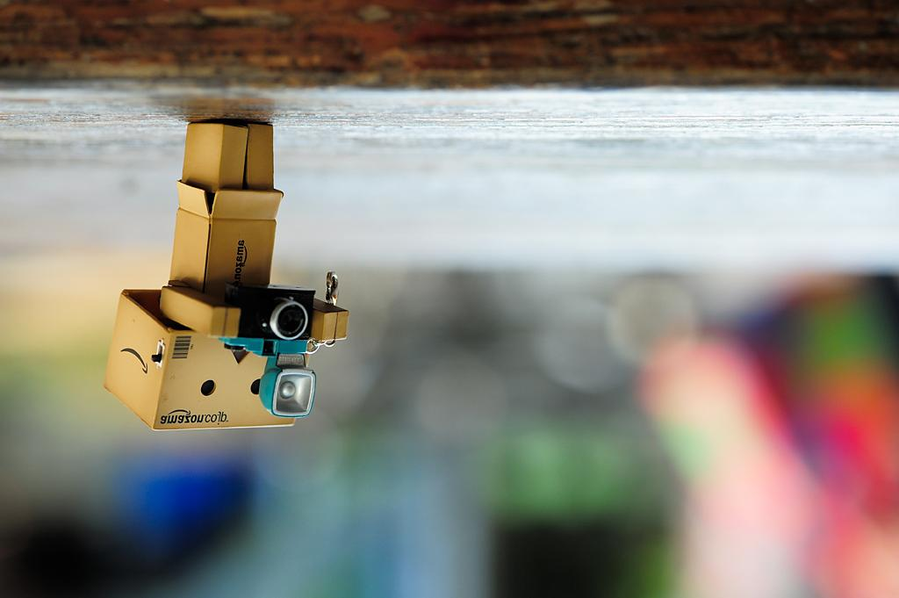
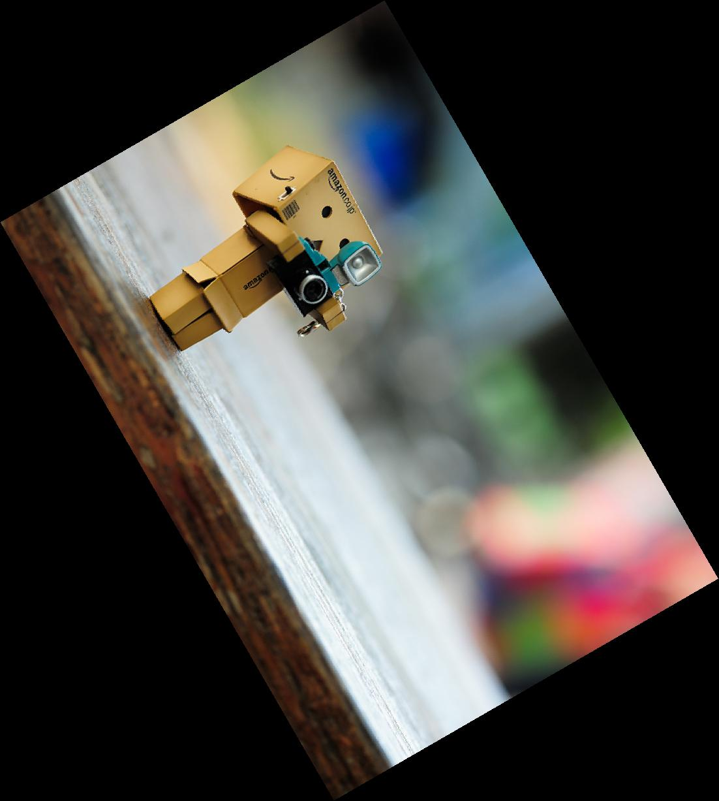
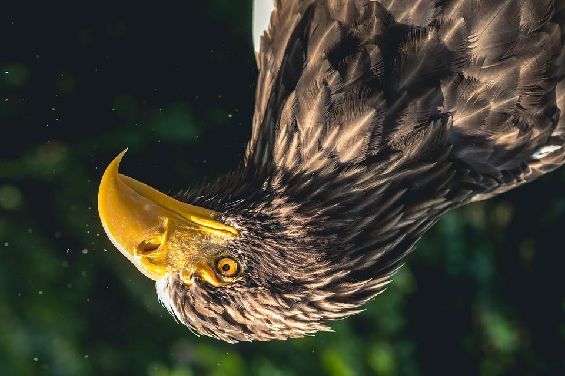
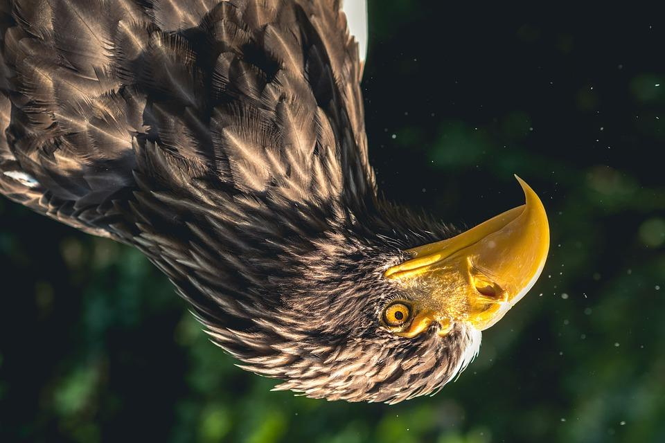
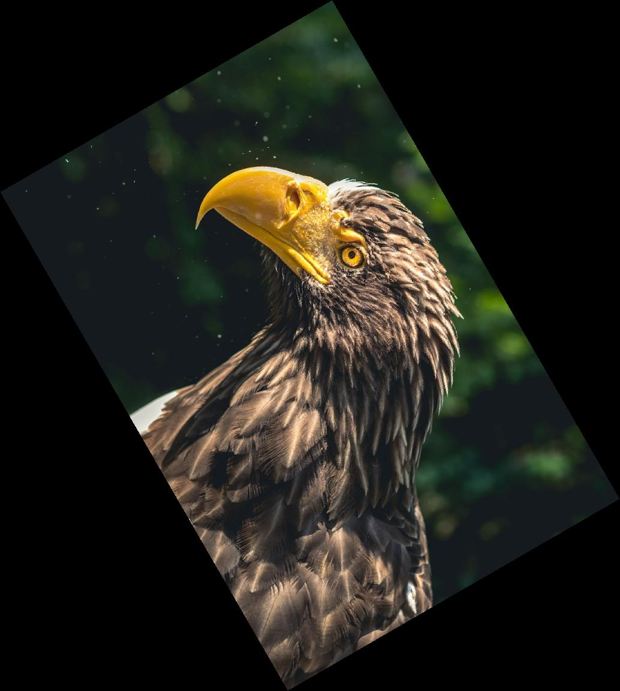

# 蔡介豪 <span style="color:red">(103061101)</span>

# DSP Lab HW0 / Image Filpping and Rotation

## Overview
The project is related to the following.

* Flipping images horizentally, vertically or both
* Rotate images


## Implementation
1. Image filpping
	* Horizental flipping
		* Fix the value of Y-axis
		* Flip the value of X-axis
		
			```
			R_flip(h, w) = double(R(h, width-w+1))/255;
			```
	* Vertical flipping
		*  Fix the value of X-axis
		*  Flip the value of Y-axis
			
			```
			R_flip(h, w) = double(R(height-h+1, w))/255;
			```
	* Vertical and horizental flipping
		*  Combine (1) and (2)
		*  Flip both the value of X-axis and Y-axis
			
			```
			R_flip(h, w) = double(R(height-h+1, width-w+1))/255;
			```

2. Image rotation
	* Record image vertex, and use rotation matrix to get new vertex.
	* Find ```minX```, ```minY```, ```maxX```, ```maxY```
	* Find ```x_shift``` and ```y_shift``` with ```minX``` and ```minY```
	* Calculate new ```width_new``` and ```height_now```, using ```ceil()``` & ```floor()``` to help get the argest width and height.
	* Shift the new pixel (```x_new```, ```y_new```) back, and rotate -radius degree to get (```x_old```, ```y_old```)
	* Use ```ceil()``` and ```floor()``` to get interpolation coordinates ```x1```, ```x2```, ```y1``` and ```y2```
	* If (```x_old```, ```y_old```) is inside the source image, calculate ```r```, ```g``` and ```b``` by interpolation, else set ```r```, ```g``` and ```b``` to 0
	* Save ```R_rot```, ```G_rot```, ```B_rot``` to output image


## Results
Image 1


<tr>
<td>






</td>
</tr>


Image 2
	
<tr>
<td>






</td>
</tr>


